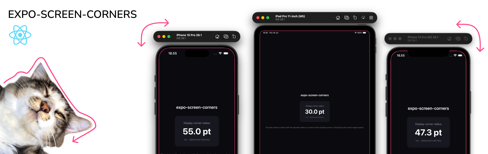

# expo-screen-corners

Get the physical corner radius of a device's screen, read natively. No lookup tables, no guessing from the model name.

```ts
import { getScreenCornerRadius } from 'expo-screen-corners';

const radius = getScreenCornerRadius(); // e.g. 55 on an iPhone 15 Pro
```

## Why I built this

Modern phones have rounded display corners, and the radius is different on almost every device. If you want a view to sit flush against the edge of the screen (a bottom sheet, a full-bleed card, a camera preview, a video call PiP), its corners should follow the same curve as the screen. When the inner radius doesn't match the outer one, the corners look slightly off, even if most people can't say why. Apple's own UI is built around this idea of concentric corners.

The usual workaround is to hardcode a number, or keep a table of "iPhone 15 Pro = 55, iPhone SE = 0, …" and try to keep it up to date forever. That breaks the moment a new device ships. iOS actually knows the real value; it just doesn't expose it publicly. This library reads it at the native level so you always get the correct radius for whatever device the app is running on.

It's a small, niche thing. Most apps will never need it. But if you're the kind of person who cares about a UI lining up perfectly with the hardware, or you're building something where that detail matters, this saves you from maintaining a device list by hand. I'd rather it exist and sit unused than have someone reinvent it later.

## Installation

```bash
npx expo install expo-screen-corners
```

This is a native module, so it needs a development build. It won't work in Expo Go. Run a prebuild first (`npx expo prebuild`) or use a dev client / `expo run:ios`.

## Usage

```tsx
import { getScreenCornerRadius } from 'expo-screen-corners';
import { View } from 'react-native';

const radius = getScreenCornerRadius();

function Card() {
  return <View style={{ borderRadius: radius }}>{/* ... */}</View>;
}
```

`getScreenCornerRadius()` is synchronous and returns the radius in points. The value doesn't change while the app is running, so you can read it once.

## API

### `getScreenCornerRadius(): number`

Returns the display corner radius in points. Returns `0` when the value can't be determined. That includes devices with square corners (older iPhones and older iPads) and platforms that don't expose it.

## Platform support

| Platform | Support |
| --- | --- |
| iOS    | Yes, reads the real display radius |
| iPadOS | Yes, same as iOS. Real value on rounded-corner iPads, `0` on older square-cornered models |
| Android | Returns `0` (see below) |
| Web    | Returns `0` |

## How it works

On iOS the display corner radius lives in a private `UIScreen` property, `_displayCornerRadius`. This library reads it through key-value coding. To keep the private key out of the compiled binary, the string is assembled at runtime from reversed pieces rather than written as a literal. The approach comes from [kylebshr/ScreenCorners](https://github.com/kylebshr/ScreenCorners).

Because it relies on a private property, there's a chance a future iOS version renames or removes it. If that happens, the call returns `0` instead of crashing, so it fails safely.

Android is a stub for now. There's `android.R.dimen.rounded_corner_radius` (API 31+) and the `RoundedCorner` API via `WindowInsets`, but neither is reliably populated across manufacturers, so returning `0` is more honest than returning a wrong number. If a dependable source shows up, it can be added later.

## Requirements

- A development build (not Expo Go)
- iOS 15.1+

## License

MIT

---

Made by [@rbayuokt](https://github.com/rbayuokt) with 🎵 and ❤️
